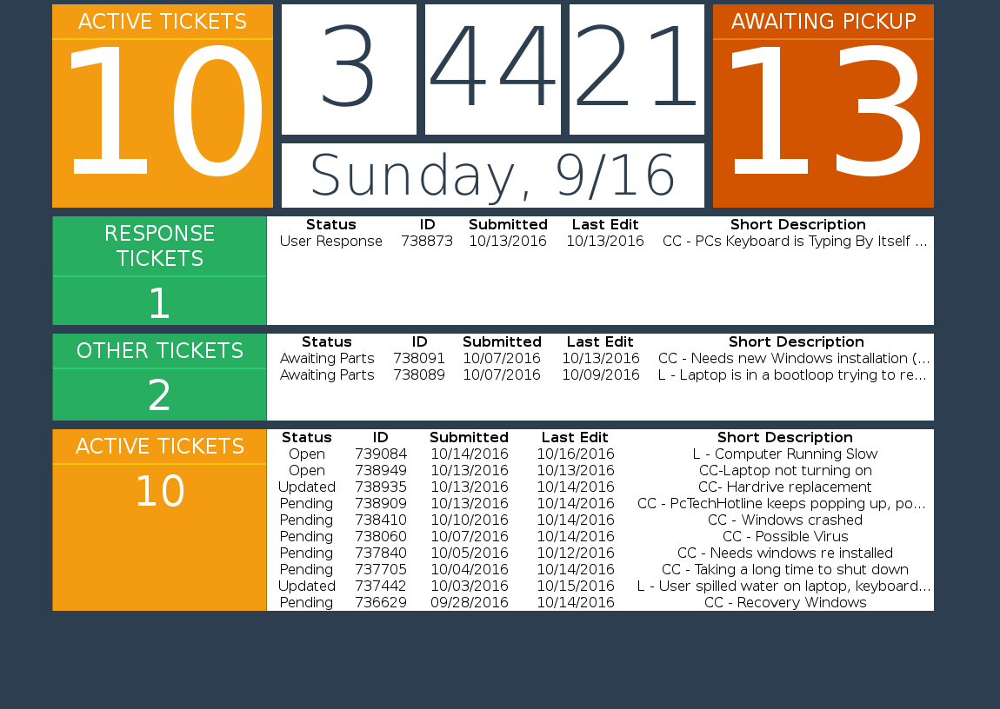

# Footprints-Statusboard
Statusboard for tickets from [BMC's Footprints ticketing system](http://www.bmc.com/it-solutions/footprints-service-core.html). Developed while at [University of Akron for SCSS](http://www.uakron.edu/helpdesk/repair/services).  
Reads a csv export from Footprints that is downloaded hourly.

